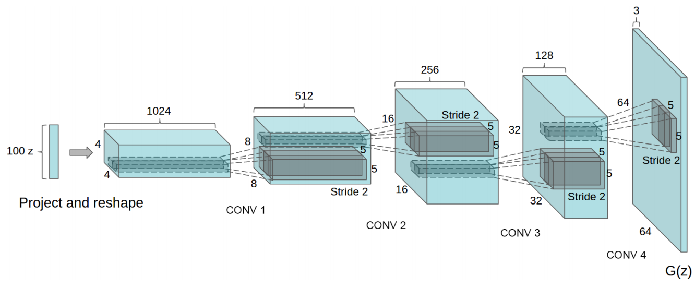

# DCGAN in Pytorch
PyTorch implementation of [Deep Convolutional Generative Adversarial Networks](http://arxiv.org/abs/1511.06434) (DCGAN), which is a stabilize Generative Adversarial Networks. The origin code can be found [here](https://github.com/soumith/dcgan.torch).

## Network architecture

* Generator
	* input: a vector with z_size.
	* hidden layers: Four 4x4 transposed convolutional layers (1024, 512, 256, and 128 kernels, respectively) with ReLU
	* output layer: 4x4 transposed convolutional layer (channel_size kernels, 4096 nodes = 64x64 size image) with Tanh.
	* BatchNormalization is used except for output layer.

* Discriminator
	* input: a vector with channel_size * image_size * image_size.
	* hidden layers: Four 4x4 convolutional layers (128, 256, 512, and 1024 kernels, respectively) with LeakyReLU (negative slope is 0.2).
	* output layer: 4x4 convolutional layer (1 node) with Sigmoid.
	* BatchNormalization is used except for 1st hidden layer and output layer.

All of the transposed convolutional layer and convolutional layer are initilized by a normal distribution with 0.0 mean and 0.02 std.

## MNIST dataset
* For MNIST image, the channel_size is 1 and image_size is 64.
### Results
* The learning rate is 0.0002, batch size is 128 and the optimizer is Adam.

<table align='center'>
<tr align='center'>
<td> Gnerated Images </td>
<td> DCGAN Loss </td>
</tr>
<tr>
<td>
<td>
</tr>
</table>

## References
1. https://github.com/soumith/dcgan.torch
2. https://github.com/znxlwm/pytorch-MNIST-CelebA-GAN-DCGAN
3. https://github.com/togheppi/DCGAN
4. https://github.com/carpedm20/DCGAN-tensorflow
5. https://github.com/last-one/DCGAN-Pytorch
